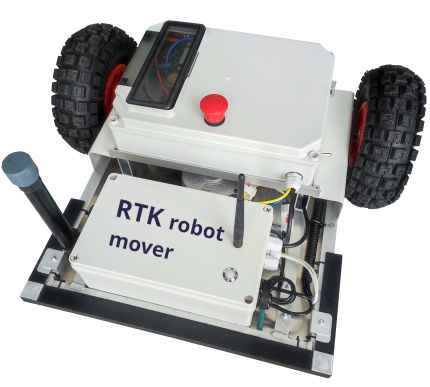

# RTK lawn robot mower

This autonomous lawn robot project is based on RTK navigation using its own RTK base station without the use of a ground wire. Uses only a closed local WiFi network for communication. Uses widely available components, so the configuration can be customized to your needs. Waypoints for work zones are semi-manually placed in QGIS software and exported to the robot in GeoJSON format. This is not a turnkey product, you will need to customize it to your needs. 

**Project objectives:**

- rtklib-based autonomous lawn robot
- Using NEO-M8T GNSS receivers
- Python main programming language 
- WEB-based user interface  ( Dash framework for GUI )
- Robust design for larger areas ( minimum 4 hours of work per charge )

**Hardware:**

How to compile arduino code:
- Disable PA11, PA12 USB serial comunication in STM core library in:
  Arduino\hardware\Arduino_STM32\STM32F1\cores\maple\usb_serial.cpp
  comment out everything inside void USBSerial::begin(void)
- Install required libraries:
  - https://github.com/rogerclarkmelbourne/Arduino_STM32
  - https://github.com/jrowberg/i2cdevlib
  - https://github.com/DFRobot/DFRobot_LSM303
- Copy customized library files to LSM303 lib, from „Customized LSM303 lib“ folder
- The STlink adapter is used to load the program
   
**Software:**
  RTKbase
